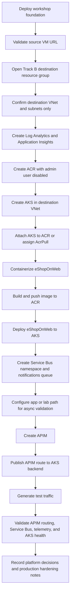

# 05 - Track B: Enterprise AKS Migration

## Objective

Migrate eShopOnWeb from the source VM to AKS and integrate enterprise platform services.

## Architecture Explanation

Track B is the production-oriented path for platform teams. The workshop provisions the source VM and a destination VNet only. You create AKS, ACR, APIM, Service Bus, and Application Insights yourself, then connect them into a coherent application platform.

Choose this track if you want to practice platform integration, controlled API exposure, messaging, and observability.

## Azure Services Used

- AKS.
- ACR.
- API Management.
- Service Bus namespace and queue or topic for notifications.
- Application Insights.
- Log Analytics.
- Destination VNet.

## Track Flow

[Open this diagram as a standalone file](../media/track-b-enterprise-flow.md).



## Steps

1. Deploy the workshop foundation:

```powershell
./infra/scripts/02-deploy-track-b-enterprise.ps1 -DestinationResourceGroupName rg-appmod-dest-b -Location westeurope -Prefix appmodb
```

2. Confirm the destination resource group contains only the destination VNet and subnets.
3. Create ACR and build or push the eShopOnWeb container image.
4. Create AKS in the destination VNet and attach or grant access to ACR.
5. Deploy eShopOnWeb to AKS.
6. Create Application Insights and connect application telemetry.
7. Create Service Bus and integrate a notification or order-processing path.
8. Create APIM and publish routes to the AKS-hosted application.
9. Validate resources:

```powershell
./infra/scripts/validate.ps1 -ResourceGroupName rg-appmod-dest-b
```

## Validation Criteria

- AKS exists in the destination VNet and can pull from ACR.
- eShopOnWeb pods are running and have a stable service endpoint.
- APIM has at least one published API operation routed to the AKS backend.
- Service Bus exists and a test message can be sent and inspected or consumed.
- Application Insights receives requests, dependencies, or custom logs from the migrated application.
- You can describe how the platform would support future service extraction.

## Expected Outcome

The application runs on AKS with enterprise-grade registry, gateway, messaging, and observability components.
