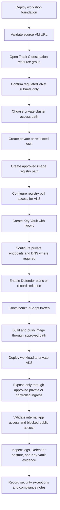

# 06 - Track C: Regulated AKS Migration

## Objective

Migrate eShopOnWeb from the source VM to AKS using private networking, secret governance, and security posture controls.

## Architecture Explanation

Track C is for regulated, financial, and public sector patterns. The workshop provisions the source VM and a destination VNet only. You create private AKS, Key Vault, Defender configuration, and private access paths yourself.

Choose this track if your success criteria include private control plane access, restricted secrets, explicit network paths, and auditable security posture.

## Azure Services Used

- Destination VNet.
- Private AKS.
- Key Vault.
- Microsoft Defender for Cloud.
- Private DNS and private endpoints where required.
- Log Analytics and Azure Monitor as selected by the attendee.

## Track Flow

[Open this diagram as a standalone file](../media/track-c-regulated-flow.md).



## Steps

1. Deploy the workshop foundation:

```powershell
./infra/scripts/03-deploy-track-c-regulated.ps1 -DestinationResourceGroupName rg-appmod-dest-c -Location westeurope -Prefix appmodc
```

2. Confirm the destination resource group contains only the destination VNet and regulated subnets.
3. Create private AKS with appropriate network settings.
4. Create Key Vault and configure RBAC, secret storage, and network restrictions.
5. Enable Defender plans appropriate for the lab subscription, such as Containers and Key Vault.
6. Containerize eShopOnWeb, store the image in an approved registry path, and deploy it to private AKS.
7. Validate application access through the approved private or controlled ingress path.
8. Document the security controls and any exceptions.

## Validation Criteria

- AKS uses private or restricted networking consistent with your selected design.
- Public access is disabled or justified for regulated services such as Key Vault.
- Secrets are not stored in manifests, shell history, or source files.
- Defender for Cloud shows the relevant plans enabled or a documented reason they cannot be enabled in the lab subscription.
- The workload runs on AKS and is reachable only through the approved access path.
- Network tests prove that disallowed public access is blocked.
- Logs or security findings can be inspected for the migrated workload.

## Expected Outcome

The application runs on AKS with regulated networking, secrets, and security posture controls that can be explained and validated.
