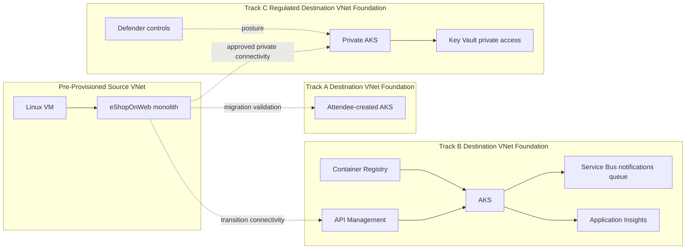

# Architecture Diagram

```mermaid
flowchart LR
    subgraph Source[Pre-Provisioned Source VNet]
        VM[Linux VM]
        ESHOP[eShopOnWeb monolith]
        VM --> ESHOP
    end

    subgraph DestA[Track A Destination VNet Foundation]
        AKSA[Attendee-created AKS]
    end

    subgraph DestB[Track B Destination VNet Foundation]
        APIM[API Management]
        ACR[Container Registry]
        AKS[AKS]
        SB[Service Bus notifications queue]
        AI[Application Insights]
        ACR --> AKS
        APIM --> AKS
        AKS --> SB
        AKS --> AI
    end

    subgraph DestC[Track C Regulated Destination VNet Foundation]
        PRIV[Private AKS]
        KV[Key Vault private access]
        DEF[Defender controls]
        PRIV --> KV
        DEF -. posture .-> PRIV
    end

    ESHOP -. migration validation .-> AKSA
    ESHOP -. transition connectivity .-> APIM
    ESHOP -. approved private connectivity .-> PRIV
```
