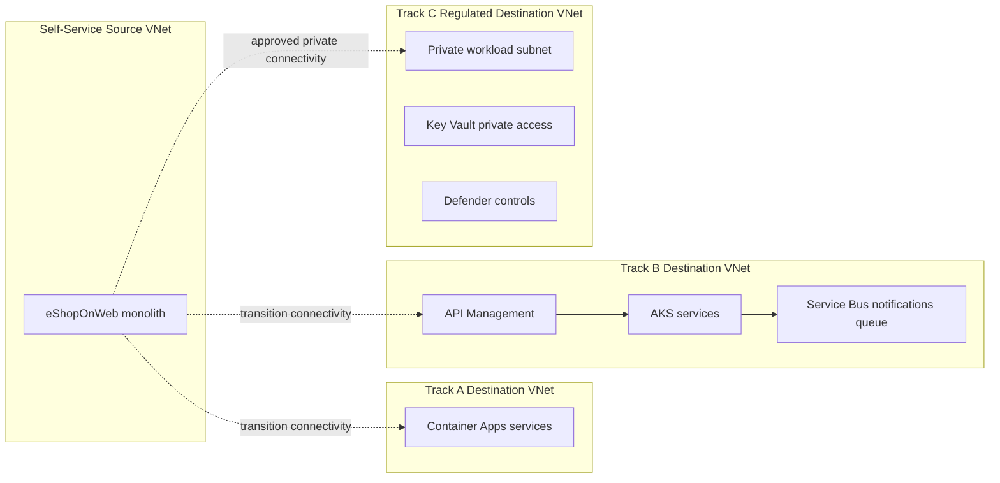

# Architecture Diagram

```mermaid
flowchart LR
    subgraph Source[Self-Service Source VNet]
        ESHOP[eShopOnWeb monolith]
    end

    subgraph DestA[Track A Destination VNet]
        ACA[Container Apps services]
    end

    subgraph DestB[Track B Destination VNet]
        APIM[API Management]
        AKS[AKS services]
        SB[Service Bus notifications queue]
        APIM --> AKS
        AKS --> SB
    end

    subgraph DestC[Track C Regulated Destination VNet]
        PRIV[Private workload subnet]
        KV[Key Vault private access]
        DEF[Defender controls]
    end

    ESHOP -. transition connectivity .-> ACA
    ESHOP -. transition connectivity .-> APIM
    ESHOP -. approved private connectivity .-> PRIV
```
