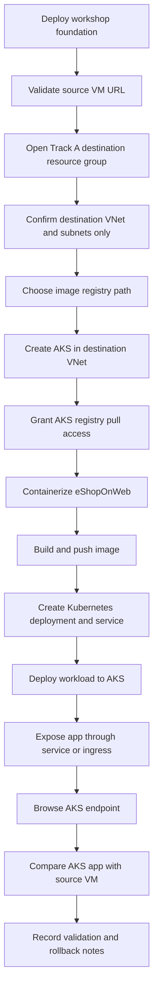

# Track A: Simple AKS Flow

```mermaid
flowchart TD
    A[Deploy workshop foundation] --> B[Validate source VM URL]
    B --> C[Open Track A destination resource group]
    C --> D[Confirm destination VNet and subnets only]
    D --> E[Choose image registry path]
    E --> F[Create AKS in destination VNet]
    F --> G[Grant AKS registry pull access]
    G --> H[Containerize eShopOnWeb]
    H --> I[Build and push image]
    I --> J[Create Kubernetes deployment and service]
    J --> K[Deploy workload to AKS]
    K --> L[Expose app through service or ingress]
    L --> M[Browse AKS endpoint]
    M --> N[Compare AKS app with source VM]
    N --> O[Record validation and rollback notes]
```
