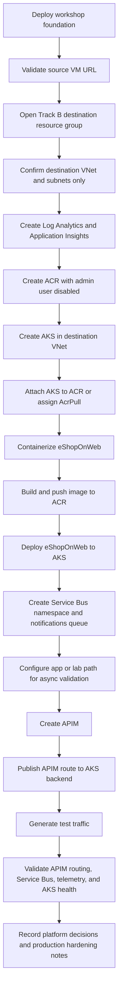

# Track B: Enterprise AKS Flow

```mermaid
flowchart TD
    A[Deploy workshop foundation] --> B[Validate source VM URL]
    B --> C[Open Track B destination resource group]
    C --> D[Confirm destination VNet and subnets only]
    D --> E[Create Log Analytics and Application Insights]
    E --> F[Create ACR with admin user disabled]
    F --> G[Create AKS in destination VNet]
    G --> H[Attach AKS to ACR or assign AcrPull]
    H --> I[Containerize eShopOnWeb]
    I --> J[Build and push image to ACR]
    J --> K[Deploy eShopOnWeb to AKS]
    K --> L[Create Service Bus namespace and notifications queue]
    L --> M[Configure app or lab path for async validation]
    M --> N[Create APIM]
    N --> O[Publish APIM route to AKS backend]
    O --> P[Generate test traffic]
    P --> Q[Validate APIM routing, Service Bus, telemetry, and AKS health]
    Q --> R[Record platform decisions and production hardening notes]
```
