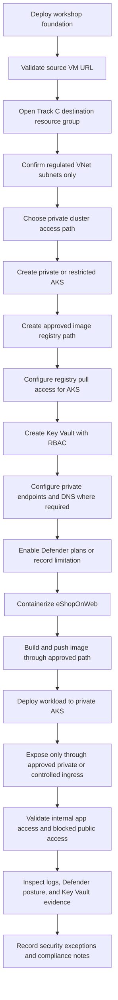

# Track C: Regulated AKS Flow

```mermaid
flowchart TD
    A[Deploy workshop foundation] --> B[Validate source VM URL]
    B --> C[Open Track C destination resource group]
    C --> D[Confirm regulated VNet subnets only]
    D --> E[Choose private cluster access path]
    E --> F[Create private or restricted AKS]
    F --> G[Create approved image registry path]
    G --> H[Configure registry pull access for AKS]
    H --> I[Create Key Vault with RBAC]
    I --> J[Configure private endpoints and DNS where required]
    J --> K[Enable Defender plans or record limitation]
    K --> L[Containerize eShopOnWeb]
    L --> M[Build and push image through approved path]
    M --> N[Deploy workload to private AKS]
    N --> O[Expose only through approved private or controlled ingress]
    O --> P[Validate internal app access and blocked public access]
    P --> Q[Inspect logs, Defender posture, and Key Vault evidence]
    Q --> R[Record security exceptions and compliance notes]
```
