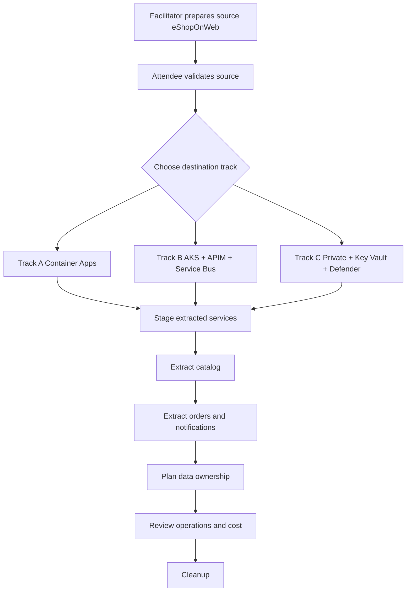

# Workshop Flow

```mermaid
flowchart TD
    A[Facilitator prepares source eShopOnWeb] --> B[Attendee validates source]
    B --> C{Choose destination track}
    C --> D[Track A Container Apps]
    C --> E[Track B AKS + APIM + Service Bus]
    C --> F[Track C Private + Key Vault + Defender]
    D --> G[Stage extracted services]
    E --> G
    F --> G
    G --> H[Extract catalog]
    H --> I[Extract orders and notifications]
    I --> J[Plan data ownership]
    J --> K[Review operations and cost]
    K --> L[Cleanup]
```
