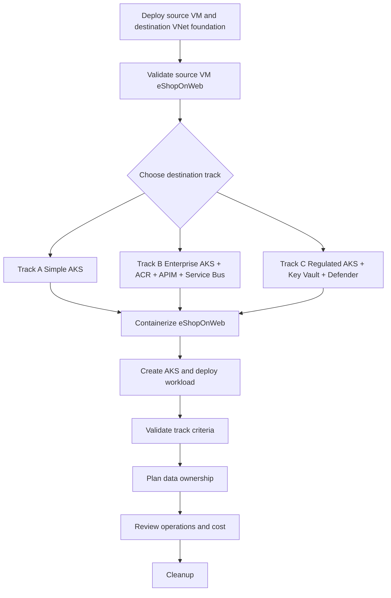

# Workshop Flow

```mermaid
flowchart TD
    A[Deploy source VM and destination VNet foundation] --> B[Validate source VM eShopOnWeb]
    B --> C{Choose destination track}
    C --> D[Track A Simple AKS]
    C --> E[Track B Enterprise AKS + ACR + APIM + Service Bus]
    C --> F[Track C Regulated AKS + Key Vault + Defender]
    D --> G[Containerize eShopOnWeb]
    E --> G
    F --> G
    G --> H[Create AKS and deploy workload]
    H --> I[Validate track criteria]
    I --> J[Plan data ownership]
    J --> K[Review operations and cost]
    K --> L[Cleanup]
```
